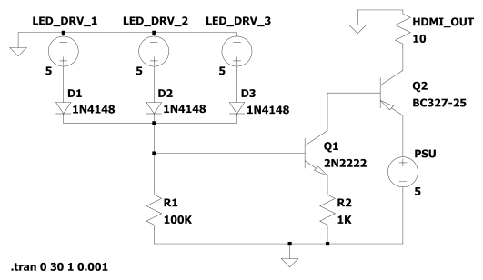
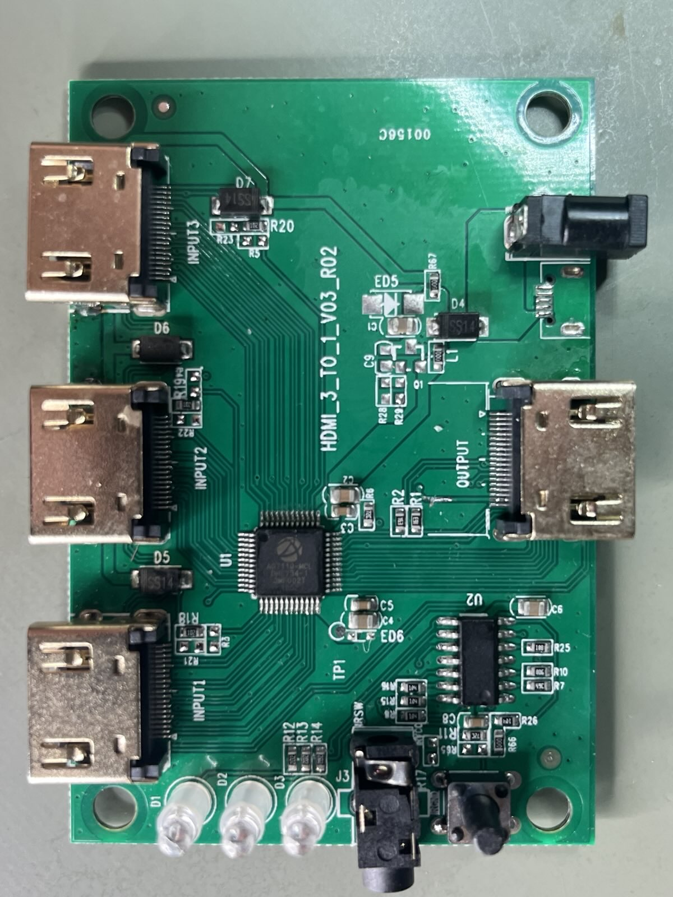
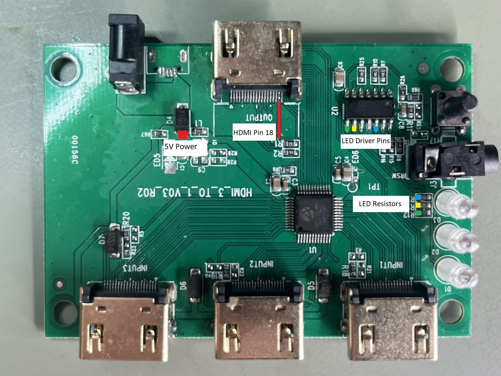
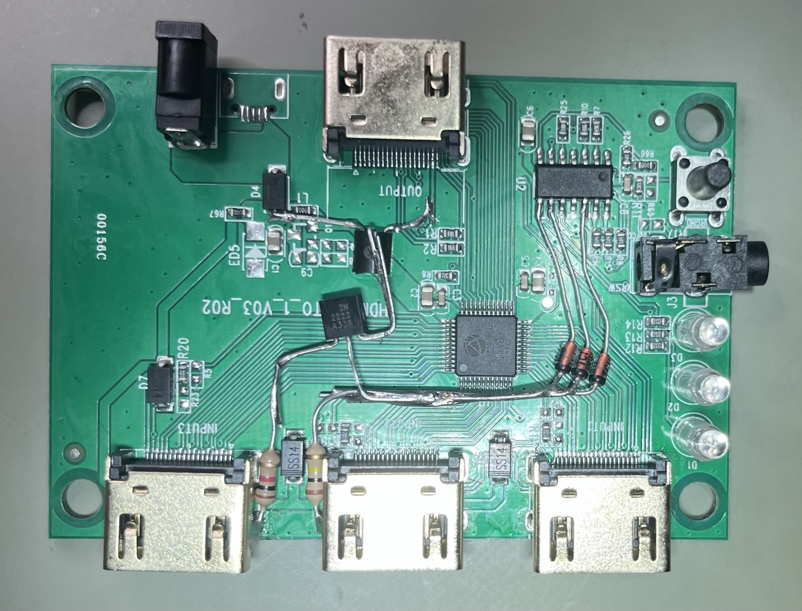

# HDMI Auto Switch Mod for Conditional 5v Output

## PROBLEM
Automatic HDMI switches generally use the 5v power from an HDMI input
in order to determine when to automatically switch inputs. However,
these same switches generally  connect their own 5v power source directly to the
5v line on their output HDMI ports. This makes daisy chaining automatic HDMI
switches impossible as once the second switch is connected to any input on
the first switch, the first switch will never again automatically change inputs.

## SOLUTION
Most automatic HDMI switches have LEDs which indicate which input has been
automatically selected, the presence of the signals which drive these LEDs 
is enough to make it possible to design a circuit that makes the HDMI 5v output
conditional on the activation of one of these LEDs. This means that the HDMI 5v
output will be ~0v when no input is active, and ~5v when an input is active.
This allows switches to be daisy chained.

## CIRCUIT
An OR gate is constructed from 1N4148 (or similar) diodes and a resistor,
100K is used to reduce additional current draw from the LED driver pin. While
the diagram shows only three LEDs (for a three input HDMI switch), as many as
are needed can be added in paralell. These signals can be tapped from either
the current limiting resistor for the LEDs or from the IC pin that drives the
LEDs.

The output signal of the OR gate is fed into a two-stage direct-coupled
amplifier made up of an NPN and a PNP transistor. The trace driving Pin 18
on the HDMI connector must be cut, then the collector of the PNP tranistor
must be connected to Pin 18.

## EXAMPLE

## NOTES
- A BC327-25 is used to allow for up to 500ma of current output, a 2N3906 can
be substituted if current draw over 200ma is not required.

- The pictured finished circuit is using a 2N3906, which was later replaced
  with a BC327-25, both configurations worked as expected.
